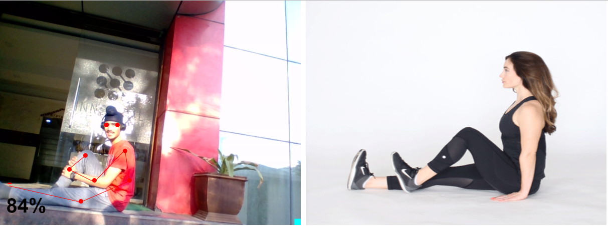
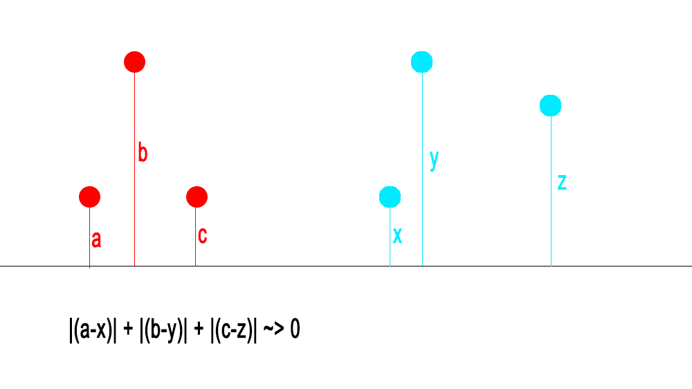

# PhysioGuide-HealthHackathon
Using an implementation of PoseNet in Tensorflow.js enabling anyone with access to the internet to treat themselves.
My project allows a patient to treat themselves or any other person to assist the patient as a physiotherapist while also recieving feedback on how well they were doing.

# Problem Statement
The average cost for a course of physiotherapy treatment is around £225 – £420(17,500₹ to 32,500₹)

A large number of people cannot afford such treatment which may lead to worsening of the situation and even permanent damage. 
Since after a lot of diseases patients are put on bedrest and face problems walking again and getting the leg muscles back in order,
physiotherapy courses are essential. 
It is utmost that the unnecessary price be removed.

# Solution - PhysioGuide

PhysioGuide provides an ideal exercise for the treatment of pain in any region of the body and compares how the user performs the 
same posture or exercise and gets a score that indicates how well he/she's doing.

I am using PoseNet to obtain keypoints. By comparing respective keypoints by a euclidian distance difference algorithm and an affine transform, I obtain the similarity of two poses, giving it a accuracy percentage score.

This score allows the user to understand how well he is doing, and at the same time give feedback to the computer whether an exercise was too difficult. This will then result in the computer suggesting an easier exercise or pointing out where the mistake was. Finding the accuracy of a pose does not give us information about where the mistake was or where the exercise had not been completed to effective perfection, hence I came up with a distance difference algorithm where from a key point, distances are measured according to ratio of heights, and subtracted respectively and added. In an ideal case each difference would be equal to zero and the sum would also total zero. However since we are comparing the difference of respecive points from a common ground, We can say that the difference furthese from zero must be the site of error.

In this case clearly |c-z| will be greater, and we can pinpoint and tell the user that he needs to bend it more or less to exercise more efficiently. He can further comment if his muscle pains which is the reason for not being able to further bend a muscle. In such a case an easier exercise will be recommended.
